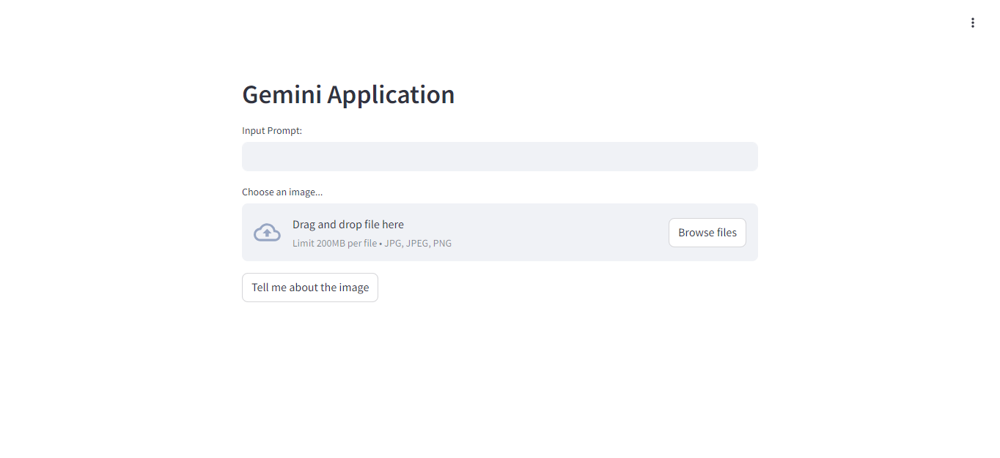
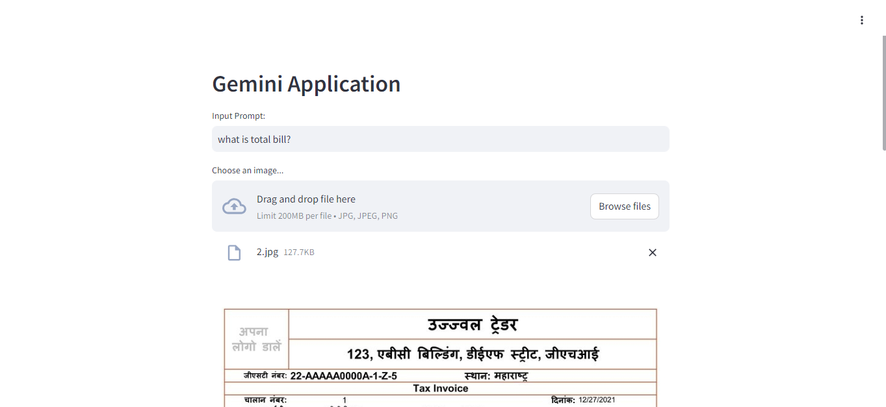
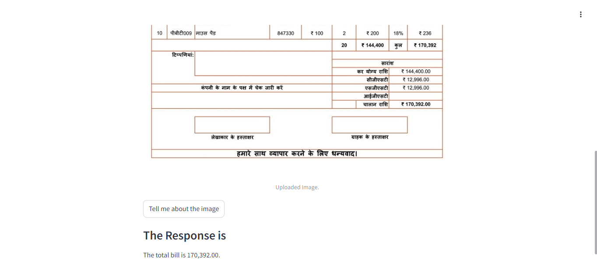

# Multi Language Invoice Generator using Gemini Pro

**How to Setup**
1. Create a virtual environment  using `virtualenv venv`
2. Start the environment `venv/Scripts/activate` or  `source venv/bin/activate`
3. Install the required packages by running `pip install -r requirements.txt`
4. Add a `.env` file in the directory to  store the  API key for Gemini which can generated from <a 
 href="https://aistudio.google.com/app/apikey">Google ai studio</a>
5. Run the app using `streamlit run app.py` 

**Outputs:** 
  
  
  
Contributed by:  
